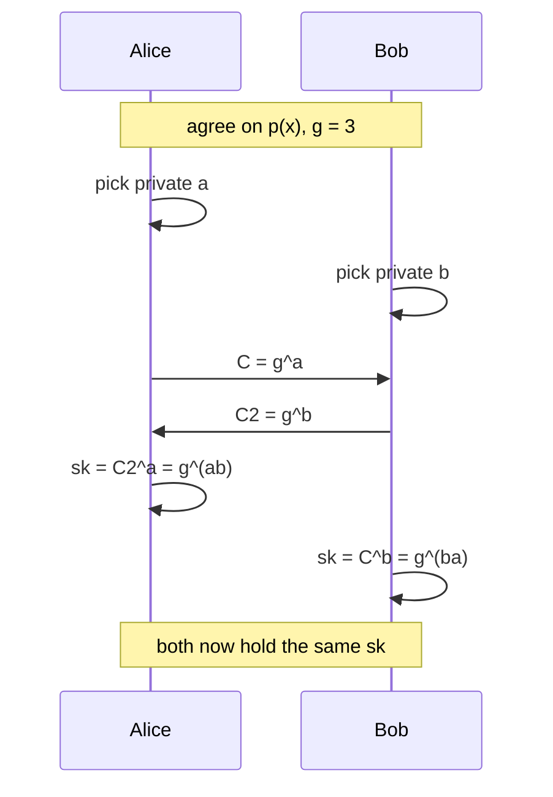

# Herradura Cryptographic Suite (v2.0.8)

[](https://github.com/Caume/HerraduraKEx/actions/workflows/ci.yml)

The Herradura Cryptographic Suite implements cryptographic protocols built on the FSCX (Full Surroundings Cyclic XOR) primitive, Diffie-Hellman key exchange over GF(2^n)*, and a post-quantum Ring-LWR key exchange. In short: it gives two parties a way to agree on a shared secret over an insecure channel, then use that secret to encrypt, sign, and verify messages — with both classical (pre-quantum) and post-quantum variants of each — implemented from scratch across six languages so the same protocols can be read, taught, and cross-checked in whichever one is most familiar.

**New to cryptography, or just to this repo?** Start with [`docs/CRYPTOGRAPHY_BASICS.md`](docs/CRYPTOGRAPHY_BASICS.md) (no prior background assumed), then [`docs/INTRODUCTION.md`](docs/INTRODUCTION.md) (plain-language walkthrough of every concept below), then [`docs/TUTORIAL.md`](docs/TUTORIAL.md) (copy-pasteable API recipes per language). The rest of this file is a compact technical reference, not a tutorial.

External tools and agents integrating HerraduraKEx as a dependency should start with [`llms.txt`](llms.txt) — a condensed, token-efficient API reference (function signatures, CLI subcommands, protocol identifiers) with pointers to the detailed docs.

---

# FSCX — The Core Primitive

FSCX is the mixing operation every protocol in this suite is built from: it takes two equal-size bitstrings and combines them by XOR-ing each with rotated copies of both, so that changing a single input bit flips bits throughout the output. Formally:

Let $A$, $B$, $C$ be bitstrings of size $P$, where $A_i$ is the $i$-th bit (from left to right), and $i \in \{0,\ldots,P-1\}$. Let $\oplus$ denote bitwise XOR and let $\circlearrowleft$, $\circlearrowright$ denote 1-bit cyclic left and right rotations respectively.

$$\text{FSCX}(A, B) = A \oplus B \oplus \circlearrowleft A \oplus \circlearrowleft B \oplus \circlearrowright A \oplus \circlearrowright B$$

Equivalently, defining the linear operator $M = I \oplus \text{ROL} \oplus \text{ROR}$:

$$\text{FSCX}(A, B) = M \cdot (A \oplus B)$$

**FSCX_REVOLVE(A, B, n)** iterates FSCX $n$ times with $B$ held constant:

$$\text{FSCX-REVOLVE}(A, B, n) = \text{FSCX}^{\circ n}(A, B)$$

For bitstrings of size $P = 2^k$, the orbit period is always $P$ or $P/2$, so $\text{FSCX-REVOLVE}(A, B, P) = A$ for all $A$, $B$.

---

# HKEX-GF — Key Exchange over GF(2^n)*

HKEX-GF is a standard Diffie-Hellman key exchange over the multiplicative group $\mathbb{GF}(2^n)^{\ast}$.

1. **Setup.** Both parties agree on an irreducible polynomial $p(x)$ of degree $n$ and a generator $g = 3$.
2. **Key generation.** Alice draws a private scalar $a$; Bob draws $b$.
3. **Public values.** Alice publishes $C = g^a$; Bob publishes $C_2 = g^b$ (all arithmetic in $\mathbb{GF}(2^n)$).
4. **Shared secret.** Alice computes $\mathit{sk} = C_2^a = g^{ab}$; Bob computes $\mathit{sk} = C^b = g^{ba}$. By commutativity of field multiplication, $g^{ab} = g^{ba}$.



An eavesdropper who sees $C$ and $C_2$ still can't compute $a$, $b$, or $\mathit{sk}$ without solving the discrete log problem in $\mathbb{GF}(2^n)^{\ast}$ — see [`docs/CRYPTOGRAPHY_BASICS.md`](docs/CRYPTOGRAPHY_BASICS.md) for why that's believed hard.

| $n$ | Primitive polynomial | Classical security |
|-----|---------------------|-------------------|
| 32  | $x^{32}+x^{22}+x^2+x+1$ (`0x00400007`) | demo only |
| 64  | $x^{64}+x^4+x^3+x+1$ (`0x1B`) | ~40 bits |
| 128 | $x^{128}+x^7+x^2+x+1$ (`0x87`) | ~60–80 bits |
| 256 | $x^{256}+x^{10}+x^5+x^2+1$ (`0x425`) | ~80–90 bits (sub-exponential attack cost, function family FFS L[1/3]; deprecated by NIST/ENISA at this bit width — see §9.2.4) |

---

# Herradura Cryptographic Suite

The suite builds protocols on top of HKEX-GF, FSCX_REVOLVE, and the v1.5.0 NL-FSCX extensions. There are three families, each giving the same basic toolkit — key exchange, symmetric encryption, signature, public-key encryption — under a different hardness assumption:

**Classical (v1.4.0)** — the baseline quartet, secure against classical (non-quantum) attackers, all built directly on HKEX-GF and FSCX_REVOLVE above:

1. **HKEX-GF** — key exchange (DH over $\mathbb{GF}(2^n)^{\ast}$, as above)
2. **HSKE** — symmetric encryption: $E = \text{FSCX-REVOLVE}(P, \mathit{key}, i)$; decrypt with $D = \text{FSCX-REVOLVE}(E, \mathit{key}, r)$
3. **HPKS** — Schnorr-style public key signature: $R = g^k$; $e = \text{FSCX-REVOLVE}(R, P, i)$; $s = (k - a \cdot e) \bmod (2^n - 1)$; verify $g^s \cdot C^e = R$
4. **HPKE** — El Gamal public key encryption: $R = g^r$; $\text{enc-key} = C^r$; $E = \text{FSCX-REVOLVE}(P, \text{enc-key}, i)$; Alice decrypts with $\text{dec-key} = R^a$

**Post-quantum / NL-hardened (v1.5.0)** — same four roles, but swap the classical building blocks for the non-linear FSCX variants (NL-FSCX) and a Ring-LWR key exchange, whose hardness is conjectured to survive a quantum attacker (see [`docs/CRYPTOGRAPHY_BASICS.md`](docs/CRYPTOGRAPHY_BASICS.md) §5.1, "Why quantum-resistant matters"):

5. **HSKE-NL-A1** — counter-mode with NL-FSCX v1: $\mathit{ks} = \text{NL-FSCX-revolve-v1}(K, K \oplus \mathit{ctr}, i)$; $E = P \oplus \mathit{ks}$
6. **HSKE-NL-A2** — revolve-mode with NL-FSCX v2: $E = \text{NL-FSCX-revolve-v2}(P, K, r)$; $D = \text{NL-FSCX-revolve-v2-inv}(E, K, r)$
7. **HKEX-RNL** — Ring-LWR key exchange (conjectured quantum-resistant): shared $m_\text{blind}$ in $\mathcal R_q = (\mathbb{Z}/q\mathbb{Z})[x]/(x^n+1)$; parties derive $C = \lfloor m_\text{blind} \cdot s \rceil_p$; agreement $K = \lfloor s \cdot \text{lift}(C_2) \rceil_{p'}$
8. **HPKS-NL** — NL-hardened Schnorr: $e = \text{NL-FSCX-revolve-v1}(R, P, i)$
9. **HPKE-NL** — NL-hardened El Gamal: $E = \text{NL-FSCX-revolve-v2}(P, \text{enc-key}, i)$; $D = \text{NL-FSCX-revolve-v2-inv}(E, \text{dec-key}, i)$

**Code-based PQC (v1.5.18)** — the signature and KEM here rest on a different post-quantum hardness assumption, syndrome decoding (SD), via the Stern zero-knowledge identification protocol made non-interactive (Fiat-Shamir):

10. **HPKS-Stern-F** — Fiat-Shamir Stern ZKP signature. Security reduces to EUF-CMA ≤ SD($n$, $t$) + NL-FSCX v1 PRF — i.e. forging a signature ("EUF-CMA", existential unforgeability under chosen-message attack) would require either breaking syndrome decoding or the NL-FSCX v1 pseudorandom function ("PRF", an output indistinguishable from random without the key). Protocol: commit $(c_0, c_1, c_2)$; challenge $b \in \{0,1,2\}$ via NL-FSCX hash; response reveals permuted $r$, $y = e \oplus r$, or permutation $\pi$. Parameters (C/Go/Python): $N = n = 256$, $t = 16$, rounds $= 32$ (production default; benchmarks use 4–8 rounds for throughput measurement). Assembly/Arduino: $N = 32$, $t = 2$, rounds $= 4$.
11. **HPKE-Stern-F** — Niederreiter KEM: $\mathit{ct} = H \cdot e'^T$; $K = \text{hash}(\mathit{seed}, e')$. The CLI's `hpke-stern` algo tag is a demo that decaps from a known $e'$; the separate `hpke-stern-kem` algo tag uses a real Black-Gray-Flip (BGF) QC-MDPC syndrome decoder (`qcmdpc_keygen`/`qcmdpc_encap`/`qcmdpc_decap_bgf` in all three suites) and does not need the plaintext error vector at decap.

Implementations are provided in C, Go, Python, ARM Thumb-2 assembly, NASM i386 assembly, and Arduino (all six targets at v1.5.19).

---

# FFI Bindings (C-backed, opt-in)

`bindings/ffi/` provides a `ctypes`-based Python wrapper and a `cgo`-based Go wrapper around `herradura.h`'s classical v1.4.0 quartet (HKEX-GF, HSKE, HPKS, HPKE), for performance-sensitive callers who want C's speed without hand-porting. The native Python and Go suites are untouched and remain the pedagogical reference implementations; the bindings are opt-in and packaged separately (`herradura_ffi.py` is independent of `HerraduraCli/primitives.py`; the Go package lives at `bindings/ffi/go`, separate from the root `herradura` package).

Build the shared library once, then use either wrapper:

```bash
bash bindings/ffi/build.sh          # builds bindings/ffi/libherradura_ffi.so

python3 bindings/ffi/python/test_ffi_correctness.py   # FFI vs. native Python, byte-for-byte
cd bindings/ffi/go && CGO_ENABLED=1 go test ./...      # FFI vs. native Go, byte-for-byte
```

Measured on this repo's dev hardware (aarch64), `hske_encrypt` (a single `FscxRevolve` call, 64 FSCX rounds):

| Path | ns/op | vs. native |
|---|---|---|
| Native Python (`fscx_revolve`) | ~322,000 | 1× |
| Python via FFI (`ctypes` → C) | ~8,900 | ~36× faster |
| Native Go (`FscxRevolve`) | ~254,700 | 1× |
| Go via FFI (`cgo` → C) | ~19,000 | ~13× faster |

The gap narrows for Go because native Go is already compiled; the FFI number there mostly reflects saved big-integer/allocation overhead plus cgo call cost. Prefer the bindings when running many operations in Python or when Go's `math/big`-based `BitArray` arithmetic is a bottleneck; prefer the native implementations for portability (no C toolchain/cgo dependency), for reading/teaching the algorithms, or when only the assembly/Arduino targets are relevant. Scope: only the classical quartet is bound — NL/PQC and Stern-F protocols are not exposed through this FFI layer (TODO #137).

---

# Build & Run Instructions

## Docker quickstart

The full six-language build matrix needs a gcc, a Go toolchain, an ARM Thumb-2 cross-compiler,
a NASM/i386-capable linker, and qemu — a real barrier for a first look. The included
`Dockerfile` installs exactly what `build_c.sh`/`build_go.sh`/`build_arm.sh`/
`build_asm_i386.sh`'s own header comments document, builds every host-portable target (C, Go,
ARM Thumb-2, NASM i386 — Arduino needs a physical/simulated board target and is out of scope),
and runs the C/Go/Python test suites plus one CLI integration test as a smoke test:

```bash
docker build -t herradurakex .
docker run --rm -it herradurakex
```

No local cross-toolchain installation required; everything happens inside the container. See
`docker-entrypoint.sh` for exactly what runs.

## C

```bash
# Full cryptographic suite (all protocols: classical, NL/PQC, Stern-F code-based)
gcc -O2 -o "Herradura cryptographic suite_c" "Herradura cryptographic suite.c"
./"Herradura cryptographic suite_c"

# Security & performance tests (in CryptosuiteTests/)
gcc -O2 -o CryptosuiteTests/Herradura_tests_c CryptosuiteTests/Herradura_tests.c
./CryptosuiteTests/Herradura_tests_c
```

## Go

```bash
# Full cryptographic suite
go run "Herradura cryptographic suite.go"

# Security & performance tests (in CryptosuiteTests/)
cd CryptosuiteTests && go run Herradura_tests.go
```

## Python

```bash
# Full cryptographic suite
python3 "Herradura cryptographic suite.py"

# Security & performance tests (in CryptosuiteTests/)
python3 CryptosuiteTests/Herradura_tests.py
```

## Assembly

```bash
# ARM Linux — full suite + tests (32-bit Thumb; classical + NL/PQC + Stern-F protocols)
arm-linux-gnueabi-gcc -o "Herradura cryptographic suite_arm" "Herradura cryptographic suite.s"
arm-linux-gnueabi-gcc -o CryptosuiteTests/Herradura_tests_arm CryptosuiteTests/Herradura_tests.s
qemu-arm -L /usr/arm-linux-gnueabi "./Herradura cryptographic suite_arm"
qemu-arm -L /usr/arm-linux-gnueabi ./CryptosuiteTests/Herradura_tests_arm

# NASM i386 — full suite + tests (pure Linux syscalls, no libc)
# Requires: nasm, x86_64-linux-gnu-ld (or ld with elf_i386 support), qemu-i386
nasm -f elf32 "Herradura cryptographic suite.asm" -o suite32.o
nasm -f elf32 CryptosuiteTests/Herradura_tests.asm -o tests32.o
x86_64-linux-gnu-ld -m elf_i386 -o "Herradura cryptographic suite_i386" suite32.o
x86_64-linux-gnu-ld -m elf_i386 -o CryptosuiteTests/Herradura_tests_i386 tests32.o
qemu-i386 "./Herradura cryptographic suite_i386"
qemu-i386 ./CryptosuiteTests/Herradura_tests_i386
# On a native x86/x86_64 Linux host the binaries run directly without qemu-i386
```

## Arduino

The `.ino` files require the Arduino IDE or `arduino-cli` with the AVR board package installed. Open in the IDE and upload to a board with a serial monitor at 9600 baud, or:

```bash
# Compile-check only (requires arduino-cli with arduino:avr board package)
arduino-cli compile --fqbn arduino:avr:uno "Herradura cryptographic suite.ino"
arduino-cli compile --fqbn arduino:avr:uno CryptosuiteTests/Herradura_tests.ino
```

---

# Performance (v1.8.9, Orange Pi 5 — RK3588, Cortex-A76 @ 2.4 GHz)

Benchmarks from `CryptosuiteTests/Herradura_tests.{c,go,py}` with `-t 1.5`.
Columns correspond to operand bit-width; for HKEX-RNL the column header is the ring degree $n$.

## C (gcc -O2)

C benchmarks use native types per size: `uint32_t` / `uint64_t` / `__uint128_t` / `BitArray`.

| Benchmark | 32-bit | 64-bit | 128-bit | 256-bit |
|-----------|--------|--------|---------|---------|
| FSCX single step | 20,118 M | 20,125 M | 20,134 M | 10.56 M ops/sec |
| HKEX-GF gf\_pow | 19,916 M | 1,990 M | 19.52 M | 124 ops/sec |
| HKEX-GF full handshake | 1,924 M | 19.60 M | 19.67 M | 30.6 ops/sec |
| HSKE round-trip | 15.75 M | 10.27 M | 5.13 M | 41.61 K ops/sec |
| HPKE El Gamal round-trip | 1,988 M | 19.84 M | 19.71 M | 40.9 ops/sec |
| NL-FSCX v1 revolve (n/4 steps) | 20,173 M | 20,184 M | 4,037 M | 105.64 K ops/sec |
| NL-FSCX v2 enc+dec | 20,185 M | 2,017 M | 20.19 M | 475.58 ops/sec |
| HSKE-NL-A1 counter-mode | 10.54 M | 6.81 M | 3.39 M | 103.40 K ops/sec |
| HSKE-NL-A2 revolve-mode | 15.73 M | 10.17 M | 4.02 M | 474.88 ops/sec |
| HKEX-RNL full handshake (n=…) | 92.3 K | 40.9 K | 18.5 K | 8.35 K ops/sec |
| HPKS-Stern-F sign+verify (N=n, rounds=8) | 198 K ops/sec | 504 ops/sec | 467 ops/sec | 52.9 ops/sec |

## Go (go run)

| Benchmark | 32-bit | 64-bit | 128-bit | 256-bit |
|-----------|--------|--------|---------|---------|
| FSCX single step | 134 K | 125 K | 104 K | 97.8 K ops/sec |
| HKEX-GF gf\_pow | 800 | 234 | 51.0 | 10.9 ops/sec |
| HKEX-GF full handshake | 222 | 53.8 | 11.4 | 2.77 ops/sec |
| HSKE round-trip | 3.99 K | 2.12 K | 769 | 397 ops/sec |
| HPKE El Gamal round-trip | 199 | 52.6 | 11.6 | 2.82 ops/sec |
| NL-FSCX v1 revolve (n/4 steps) | 12.4 K | 5.47 K | 2.50 K | 1.15 K ops/sec |
| NL-FSCX v2 enc+dec | 760 | 191 | 46.9 | 11.5 ops/sec |
| HSKE-NL-A1 counter-mode | 11.0 K | 5.27 K | 2.29 K | 1.11 K ops/sec |
| HSKE-NL-A2 revolve-mode | 630 | 195 | 49.5 | 12.1 ops/sec |
| HKEX-RNL full handshake (n=…) | 11.3 K | 7.02 K | 2.72 K | 1.42 K ops/sec |
| HPKS-Stern-F sign+verify (N=n, rounds=4) | 21.8 ops/sec | 16.5 ops/sec | 8.28 ops/sec | 3.28 ops/sec |

## Python 3

| Benchmark | 32-bit | 64-bit | 128-bit | 256-bit |
|-----------|--------|--------|---------|---------|
| FSCX single step | 156 K | 161 K | 160 K | 158 K ops/sec |
| HKEX-GF gf\_pow | 1.90 K | 484 | 120 | 27.6 ops/sec |
| HKEX-GF full handshake | 504 | 118 | 28.0 | 6.70 ops/sec |
| HSKE round-trip | 4.82 K | 2.53 K | 1.27 K | 628 ops/sec |
| HPKE El Gamal round-trip | 457 | 113 | 27.5 | 6.61 ops/sec |
| NL-FSCX v1 revolve (n/4 steps) | 14.4 K | 7.49 K | 3.75 K | 1.85 K ops/sec |
| NL-FSCX v2 enc+dec | 1.04 K | 294 | 80.7 | 20.5 ops/sec |
| HSKE-NL-A1 counter-mode | 13.0 K | 7.05 K | 3.65 K | 1.83 K ops/sec |
| HSKE-NL-A2 revolve-mode | 1.04 K | 296 | 80.8 | 20.5 ops/sec |
| HKEX-RNL full handshake (n=…) | 1.12 K | 543 | 256 | 119 ops/sec |
| HPKS-Stern-F sign+verify (N=n, rounds=4) | 26.7 ops/sec | 15.6 ops/sec | 6.11 ops/sec | 1.82 ops/sec |

---

# Repository Structure

```
Herradura cryptographic suite.{c,go,py,s,asm,ino}  — protocol suite (all six language targets)
herradura.h                                         — header-only C library (Protocol Layer wrappers)
CryptosuiteTests/
  Herradura_tests.{c,go,py,s,asm,ino}              — security tests & benchmarks
  go.mod
HerraduraCli/                                       — Python CLI (genpkey/pkey/kex/enc/dec/sign/verify)
Mcp/                                                 — MCP server exposing the CLI as agent-callable
                                                      tools (stdlib-only, no external dependency);
                                                      see Mcp/README.md for the trust model
spec/                                                — machine-readable protocol spec (JSON Schema):
                                                      parameters, PEM wire-format labels, CLI --algo
                                                      tags, and security-level classification per
                                                      protocol — the canonical source for tooling/LLMs
SecurityProofsCode/                                 — standalone Python proof and analysis scripts
SecurityProofs-1.md                                 — formal analysis §1–§8 (algebraic foundations,
                                                      protocol security, quantum attack analysis,
                                                      experimental code index)
SecurityProofs-2.md                                 — formal analysis §9–§10 (non-linear proposals,
                                                      v1.4.0 migration)
SecurityProofs-3.md                                 — formal analysis §11–§11.8.2 (non-linearity and
                                                      post-quantum extensions, NL-FSCX v1/v2, HKEX-RNL)
SecurityProofs-4.md                                 — formal analysis §11.8.3–§11.9.11 (PQ signature
                                                      options, HFSCX-256-DM hash)
SecurityProofs-5.md                                 — formal analysis §11.10–§11.13, §11.15–§11.19
                                                      (ZKP extensions, research-review sections)
SecurityProofs.md                                   — split index (redirects to the five files above)
MIGRATING.md                                        — consolidated breaking-change history and
                                                      upgrade notes
docs/
  CRYPTOGRAPHY_BASICS.md                            — cryptography fundamentals primer (no prior background required)
  INTRODUCTION.md                                   — plain-language cryptographic concepts primer
  TUTORIAL.md                                       — integration tutorial (C/Go/Python API recipes)
  examples/                                         — minimal runnable examples (C, Go, Python)
```

---

# Known Limitations

These are accepted, currently-shipping limitations — not bugs, and not blocking issues.
Each is tracked and documented at the citation given; this section exists so they're
visible without having to search `TODO_DONE.md`.

- **HPKS-NL / HPKE-NL are not quantum-resistant.** They harden the classical Schnorr/El
  Gamal constructions with the non-linear FSCX primitive, but remain built on the DLP
  over `GF(2^n)*` — Shor's algorithm still breaks them. No lattice-based replacement is
  planned for these two specifically; use HPKS-Stern-F/HPKE-Stern-F or the HKEX-RNL
  quartet for genuine post-quantum security (TODO #5, `TODO_DONE.md` — deprecated by
  design, not an open item).
- **HPKS-Stern-F / HPKE-Stern-F ship at demo scale.** The default parameters (N = n =
  256, t = 16, 32 Fiat-Shamir rounds) are a low-soundness demonstration configuration.
  Production-grade parameters require N on the order of 17,000+ for 128-bit security —
  a substantially larger, unimplemented configuration. Treat both protocols as
  reference implementations of the Stern ZKP construction, not as production-ready code
  signing or KEM at their current defaults. This caveat covers the `hpke-stern` CLI algo
  tag specifically (its decap needs the plaintext error vector); the separate
  `hpke-stern-kem` tag uses a real BGF QC-MDPC decoder instead and doesn't share that
  particular limitation, though its toy parameters (r = 523, d = 15, t = 18) haven't had
  their decoding-failure rate (DFR) measured at production security margins either. The
  round count is a separate, independent axis from N: `sign --algo hpks-stern`/`hpks-ring`
  in the Python and Go CLIs accept `--rounds` (219 reaches 128-bit Fiat-Shamir soundness;
  the C CLI takes the same value at compile time via `-DSDF_ROUNDS=219`), but raising
  rounds alone does not fix the N = 256 SD-hardness shortfall above.
- **Two security tests are FAIL-by-design.** Test `[4]` (bit-frequency bias) and C test
  `[18]` (HPKE-Stern-F brute-force decap) are expected to intermittently or consistently
  report FAIL under the suite's own test harness — this is documented, acknowledged
  behavior (`TODO_DONE.md` #85, #86), not a regression. Don't treat either as a build
  gate.
- **Arduino/AVR CI is a required, blocking job (TODO #185, v2.0.6).** It ran
  `continue-on-error: true` from its introduction (TODO #153, v1.9.120) until the
  ATmega2560 SRAM overflow behind its only failures was fixed (TODO #155, v1.9.122);
  it has passed 100% of runs since (0 failures across 74 runs as of this review) and
  now blocks merges like the native and ARM/i386 jobs.
- **The QC-MDPC BGF decoder and Ligero-lite IOP prototypes are research code**, not
  wired into any CLI subcommand or production path (`SecurityProofsCode/`
  `qc_mdpc_bgf_prototype.py`, `nl_fscx_ligero.py`).

See [`MIGRATING.md`](MIGRATING.md) if you're upgrading from a version predating v1.9.36
— three breaking changes in the suite's history are consolidated there.

---

# License

Dual-licensed under GPL v3.0 and MIT. Users may choose either.
